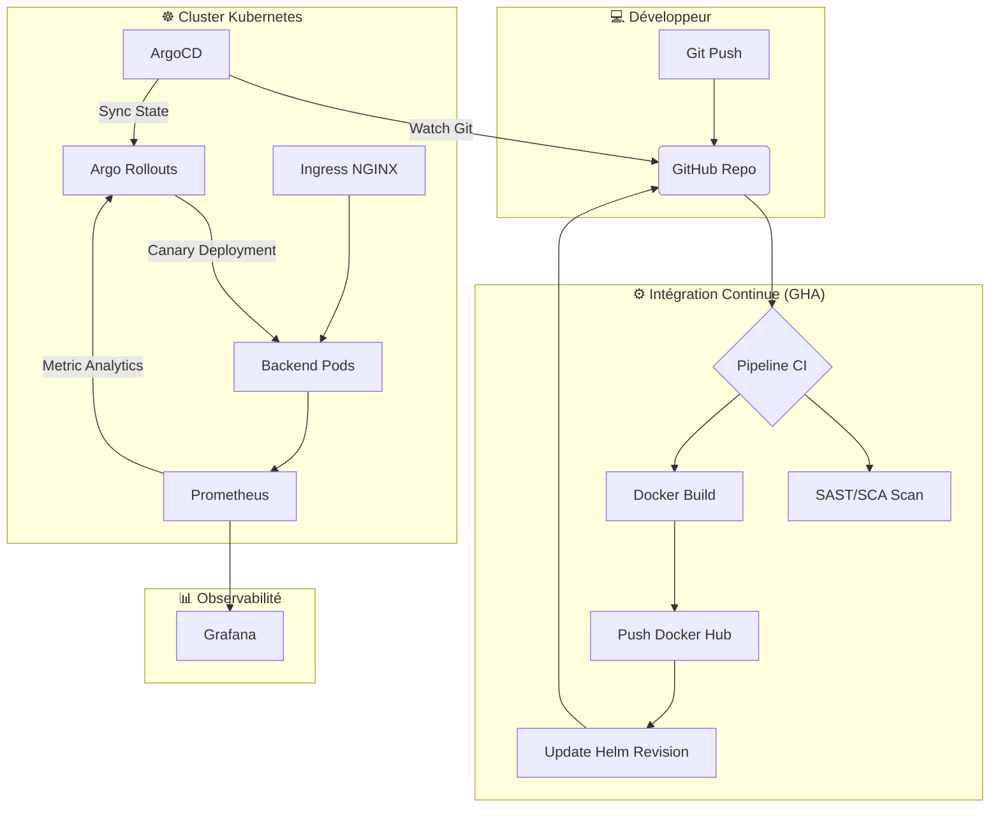

# 🚀 Plateforme DevOps GitOps Complète

Ce projet est une implémentation complète d'un pipeline CI/CD GitOps moderne pour une application Full-Stack (Spring Boot + Angular).

## 🏗️ Architecture du Projet

- **Backend** : Spring Boot 3.x (Java 17) avec Actuator & Micrometer pour le monitoring Prometheus.
- **Frontend** : Angular 17 avec un design premium (Glassmorphism, Dark Mode).
- **CI Pipeline** : GitHub Actions (Build, Test, SAST Scan, Docker Push).
- **CD Pipeline** : ArgoCD (GitOps) pour le déploiement sur Kubernetes.
- **Infrastructure** : Helm Charts pour la gestion des manifests K8s.
- **Observabilité** : Stack Prometheus + Grafana intégrée.
- **Progressive Delivery** : Support pour Argo Rollouts (Canary Release).

## 📊 Flux de Production (Architecture GitOps)



## 📂 Structure des Répertoires

```
.
├── backend/                # API Spring Boot
├── frontend/               # UI Angular
├── k8s/                    # Helm Charts (Kubernetes)
├── argocd/                 # Manifests ArgoCD Application
├── monitoring/             # Config Prometheus & Grafana
├── .github/workflows/      # CI Pipeline GitHub Actions
└── docker-compose.yml      # Test local rapide
```

## 🛡️ Mode Soutenance (Vérifié & Stable)

Pour démarrer l'environnement complet après un redémarrage (Reboot) :

1.  **Pré-requis** : Docker Desktop doit être lancé.
2.  **Démarrage Automatique** : Lancez `powershell -ExecutionPolicy Bypass -File .\RECOVERY_MASTER.ps1` dans le dossier du projet.
3.  **Tableau de Bord** : Ouvrez **`DEV_DASHBOARD.html`** pour accéder à tous les services.
4.  **Grafana** : En cas de réinitialisation, importez l'ID **11378** via `localhost:3000`.

Pour plus de détails, consultez le [Guide de Récupération Complet](./POST_REBOOT_RECOVERY.md).

## 🌟 Pack Excellence (DevOps Engineer Level)

Ce projet inclut des fonctionnalités avancées pour une robustesse maximale :

1.  **Auto-Scaling (HPA)** : Les Pods se multiplient automatiquement sous la charge (CPU > 70%).
2.  **Canary Analysis** : Utilisation d'**Argo Rollouts** avec validation Prometheus. Si le taux d'erreur augmente, le déploiement est stoppé.
3.  **Logs Centralisés** : Log management via **Grafana Loki** & **Promtail**.
4.  **Secrets as Code** : Support pour **Sealed Secrets** (chiffrement des secrets dans Git).

---

## 🚀 Comment Démarrer

### 3. Pipeline CI/CD
Le pipeline est défini dans `.github/workflows/main.yml`. Vous devez configurer les secrets suivants dans votre dépôt GitHub :
- `DOCKERHUB_USERNAME`
- `DOCKERHUB_TOKEN`

## 📊 Observabilité
Le backend expose des métriques Prometheus sur `/actuator/prometheus`. 
Le dossier `monitoring/` contient les configurations de base pour déployer Prometheus dans votre cluster.

## 🌈 Design Aesthetics
Le frontend a été conçu avec une esthétique premium :
- **Glassmorphism** : Cartes semi-transparentes avec flou d'arrière-plan.
- **Dark Mode** : Palette de couleurs sombre et élégante.
- **Animations** : Transitions fluides et chargement dynamique.
- **Typographie** : Utilisation de la police 'Outfit' pour un look moderne.

---
Projet réalisé par **Antigravity** pour une démonstration d'expertise DevOps & GitOps.
