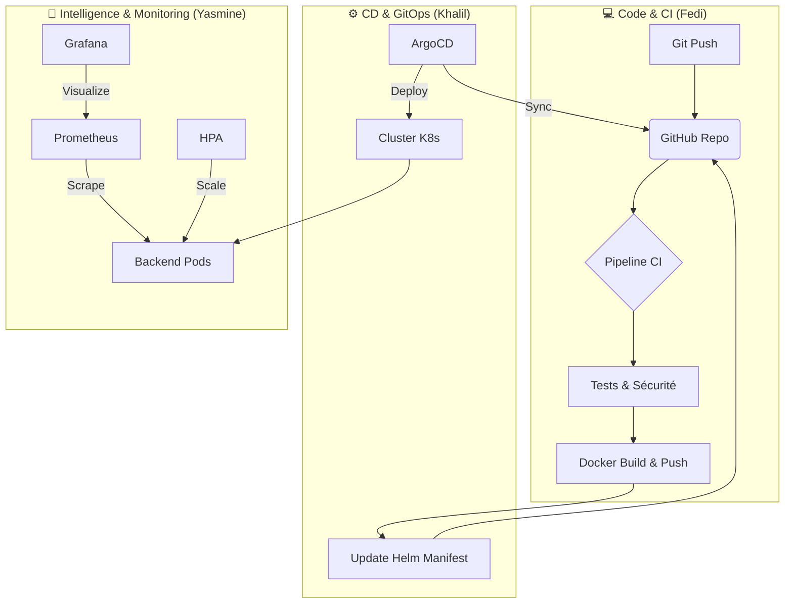

# 🚀 Plateforme DevOps & GitOps de Niveau Entreprise

Bienvenue dans ce projet d'ingénierie logicielle avancée. Ce dépôt ne contient pas seulement une application, mais une **usine logicielle complète** (Software Factory) démontrant une maîtrise de bout en bout du cycle de vie DevOps.

---

## 📚 Documentation Officielle

Pour comprendre les détails techniques et l'organisation du projet, veuillez consulter les documents de référence :

### 📘 [Guide Technique Complet (PROJECT_GUIDE.md)](./PROJECT_GUIDE.md)
*   Architecture détaillée (Microservices, K8s).
*   Explication des choix technologiques (ArgoCD, Rollouts, Prometheus).
*   Fonctionnement de l'Auto-Scaling et de la Résilience.

### 👥 [Rôles & Responsabilités (TEAM_ROLES.md)](./TEAM_ROLES.md)
*   **Khalil** : Lead GitOps, CD & Orchestration (*Le Cerveau*).
*   **Fedi** : Lead CI, Sécurité & Frontend (*Le Gardien*).
*   **Yasmine** : Lead Backend, Data & Observabilité (*Les Yeux*).

---

## 🏗️ Architecture Technique (Survol)

Notre plateforme repose sur les piliers du **Cloud-Native Computing** :

*   **Continuous Integration (CI)** : GitHub Actions (Build, Test, SAST, Container Scan).
*   **Continuous Delivery (CD)** : ArgoCD (GitOps Pattern).
*   **Progressive Delivery** : Argo Rollouts (Canary Release avec analyse métrique).
*   **Infrastructure** : Kubernetes (Minikube) piloté par Helm Charts.
*   **Observabilité** : Prometheus (Metrics) & Grafana (Dashboards).

---

## 📊 Flux de Production (GitOps Loop)



---

## 🚀 Démarrage Rapide (Mode Soutenance)

Pour lancer la démonstration technique (après un redémarrage PC) :

1.  Assurez-vous que **Docker Desktop** est lancé.
2.  Exécutez le script d'automatisation :
    ```powershell
    powershell -ExecutionPolicy Bypass -File .\RECOVERY_MASTER.ps1
    ```
3.  Le **Cockpit de Démonstration (`DEV_DASHBOARD.html`)** s'ouvrira automatiquement.

---

## 🌟 Fonctionnalités Clés (Highlights)

*   ✅ **Self-Healing** : Le cluster se répare tout seul.
*   ✅ **Auto-Scaling (HPA)** : Passage automatique de 3 à 5 pods sous charge (testé avec 20 utilisateurs virtuels).
*   ✅ **Zero-Downtime** : Déploiements Canary sans interruption de service.
*   ✅ **Sécurité** : Scan de vulnérabilités intégré dans la CI.

---

*Projet réalisé pour la démonstration d'expertise DevOps 2026.*
